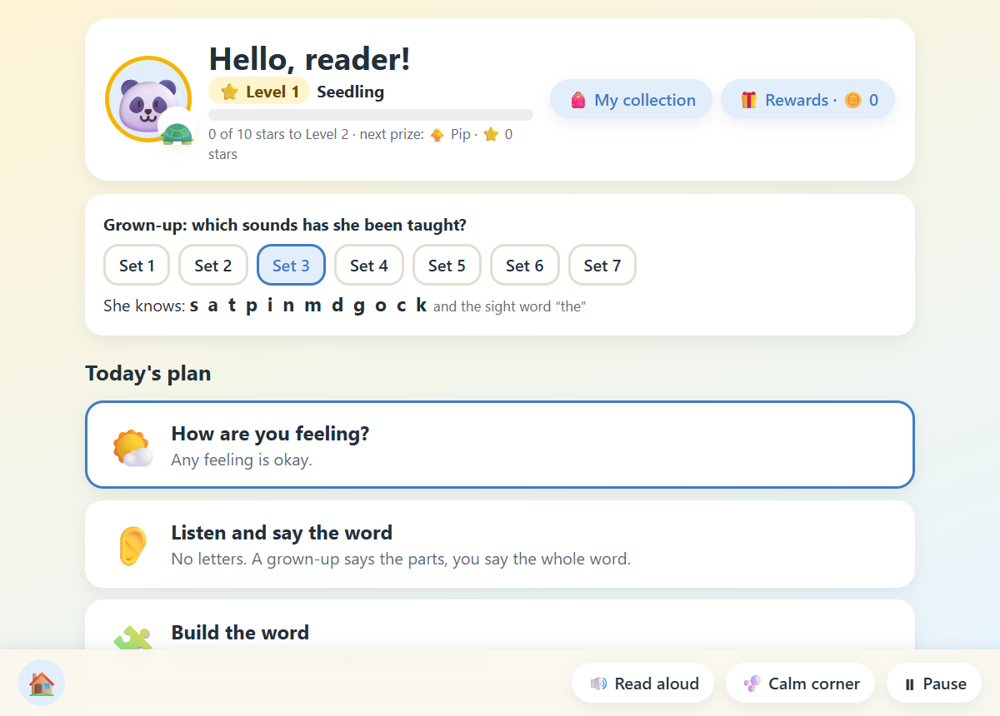
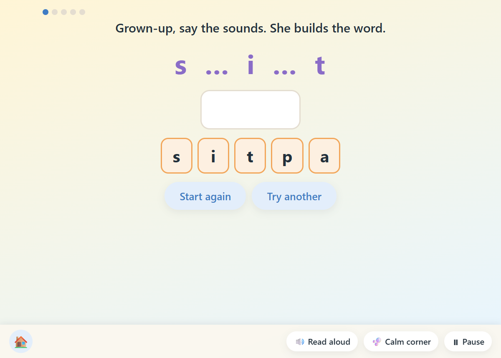
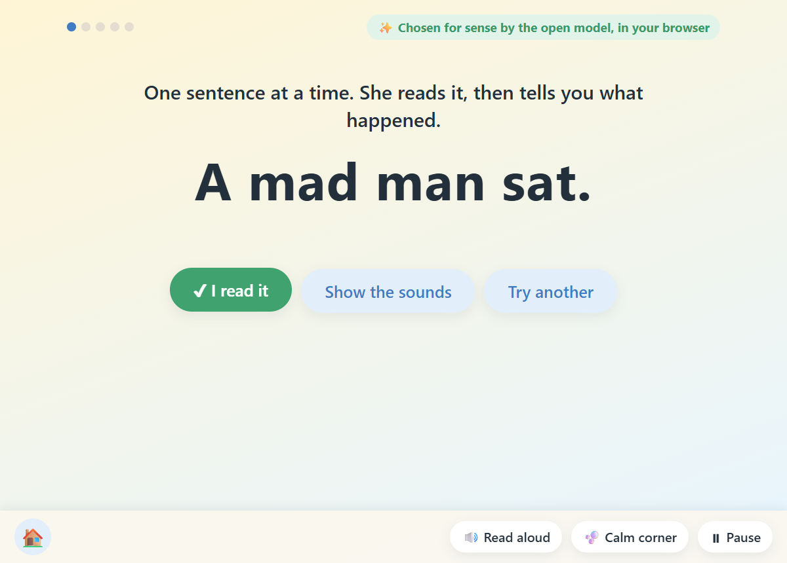
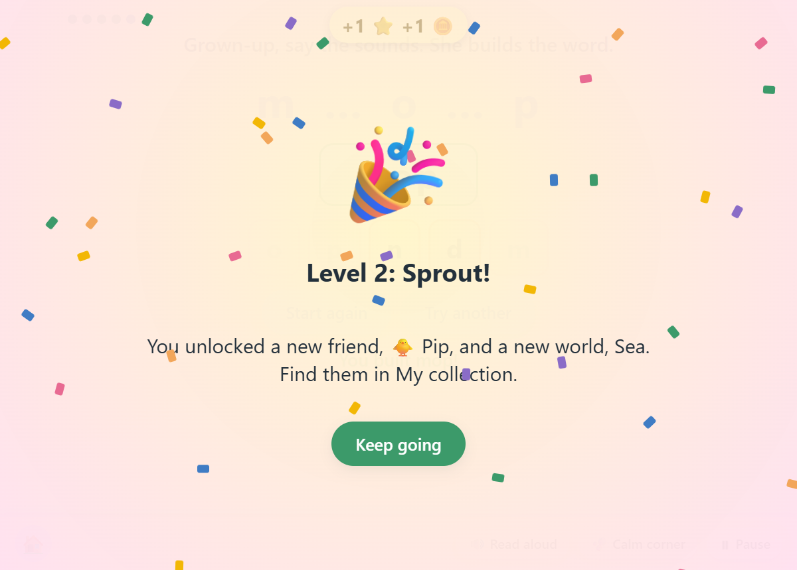
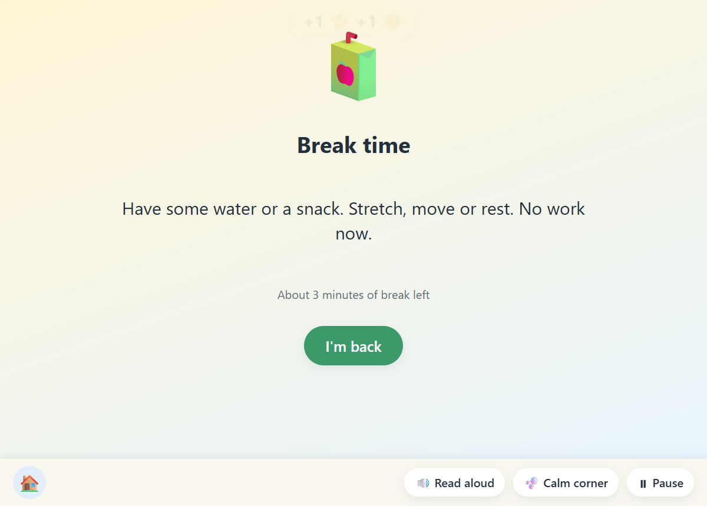
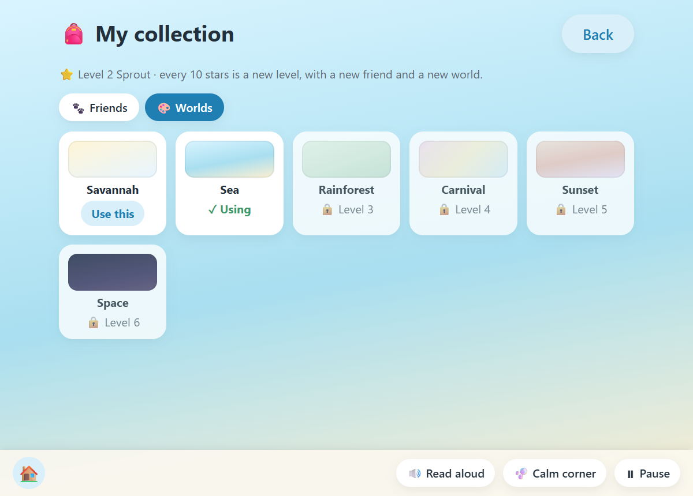

# readable-for-her

A little reading school for a child who is learning to read, where every single word is one she can
actually sound out.

**Try it now, nothing to install: https://ryahai.github.io/readable-for-her/**



## Why

A child learning to read is taught letter-sounds a few at a time. A sentence is only real practice if
every word in it can be sounded out with the sounds she has so far.

Most "easy" sentences fail that test. "The duck is in the pond" looks like beginner material. But a
child who has not yet been taught that ck is one sound cannot read "duck". She can only guess, and
guessing is the habit you are trying not to build.

So you tell this which sounds she has learned, and it gives her words, sentences and tiny stories made
only from those sounds. A small open model, running on your own device, then picks the ones that make
sense, so she reads "The dog can dig" and not "The mat can dig".

## How a day goes

She picks a face. No name, no sign-up. Then:

1. How are you feeling? Any feeling is okay. A sad or worried face is offered the calm corner first.
2. Listen and say the word. No letters. A grown-up says "m ... a ... p", she says "map".
3. Build the word. A grown-up says the sounds, she taps the tiles.
4. Read the word.
5. Break time. Water, a snack, a stretch. No work.
6. Word chains. tin, pin, pit, sit. One sound changes each time.
7. Phrases, then sentences, then a story of five sentences about one person.
8. What went well today?



Every word she reads earns a star and a coin. Ten stars is a new level, with a new friend and a new
world to unlock. Coins buy rewards, and a grown-up has to agree each one. A calm corner and a pause
button are always in reach, and a warm recorded voice reads the instructions aloud.





The app never decides she has passed. She moves up when she gets four out of five without help, on two
different days, and the grown-up decides.

There is also a box for grown-ups: type any sentence from a real book and it shows which words she
cannot sound out yet.

## How it works

Rules decide what she can read. A word only gets in if it can be split, left to right, into sounds she
has been taught. Two letters that make one sound (ck, ll, ss) count as one sound, so "sock" is never
offered as s-o-c-k. This part cannot put an unreadable word on the page, and a test proves it by
checking every word at every level.

A small model decides what makes sense. Each possible sentence is scored by
[SmolLM2-135M](https://huggingface.co/HuggingFaceTB/SmolLM2-135M-Instruct), an open-weight model. The
score is how surprised the model is by the sentence: "The cat sat on a mat" scores better than "The mat
sat on a cat". The model never writes anything. It only chooses, so it cannot break the spelling rules.

It all runs in the browser. The model runs inside the page through Transformers.js, in a background
worker so the page stays responsive. There is no server and no account, and nothing is sent anywhere.
The first sentence page downloads the model (about 100 MB, once). If the model cannot load, the page
says so and carries on with the rules alone, clearly labelled.

The voice is a second open model. The lines the page says aloud were recorded once with
[Kokoro-82M](https://huggingface.co/hexgrad/Kokoro-82M), so every visitor hears the same natural voice
in any browser. The voice does not say the letter-sounds: a grown-up does, because a child learns
blending from a real person and a machine gets single sounds wrong.





## The sounds

Letter-sets follow the order most UK synthetic-phonics programmes use (Letters and Sounds):

| Set | Letter-sounds |
|---|---|
| 1 | s a t p |
| 2 | i n m d |
| 3 | g o c k |
| 4 | ck e u r |
| 5 | h b f ff l ll ss |
| 6 | j v w x |
| 7 | y z zz qu |

Pick the set she has reached on the home screen.

## For grown-ups who like a terminal

The same rules are also a small command-line tool, for printing a page of sentences or checking a book.
It needs Node.js 20 or later.

```
git clone https://github.com/ryahai/readable-for-her
cd readable-for-her
npm install
node src/cli.js --stage 3
node src/cli.js --step story --stage 3
node src/cli.js --check "The duck is in the pond" --stage 3
node src/cli.js --ladder
```

`--letters s,a,t,p,i,n` uses exactly those sounds, `--no-model` skips the model, and `--help` lists the rest.

## What is in here

| File | Job |
|---|---|
| `index.html`, `demo.js`, `demo.css` | The reading school in the browser |
| `demo-worker.js` | Runs the rules and the model in the background |
| `src/phonics.js`, `src/words.js` | The sounds, the word bank and the reading rules |
| `src/generate.js`, `src/ladder.js` | Sentences, phrases, chains, stories, listening items |
| `src/scorer.js`, `src/cli.js` | The model scorer and the command-line tool |
| `voice-lines.js`, `voice/`, `tools/make-voice.mjs` | The spoken lines and how they were recorded |
| `test/` | Twenty-five tests (`npm test`) |

## Limits

- The model is tiny, so some sentences are silly. They are still readable, which is the part that has to be right.
- Stories are loose: one person, things happening, no real plot.
- English only, short-vowel words only.
- Set 1 alone cannot make a sentence; the page says so and asks for a later set.
- On a slow computer the model can take a minute to choose a page the first time. There is a "skip the model" button.
- Stars and coins are kept only on the device.

## Built with

- [Transformers.js](https://github.com/huggingface/transformers.js) (Apache-2.0)
- [SmolLM2-135M-Instruct](https://huggingface.co/HuggingFaceTB/SmolLM2-135M-Instruct) (Apache-2.0)
- [Kokoro-82M](https://huggingface.co/hexgrad/Kokoro-82M) (Apache-2.0), through kokoro-js

The code in this repository was written by an AI coding agent (Claude Code) working to its owner's
direction, during the DEV Hacktoberfest 2026 Weekend Challenge window.

## Licence

MIT
