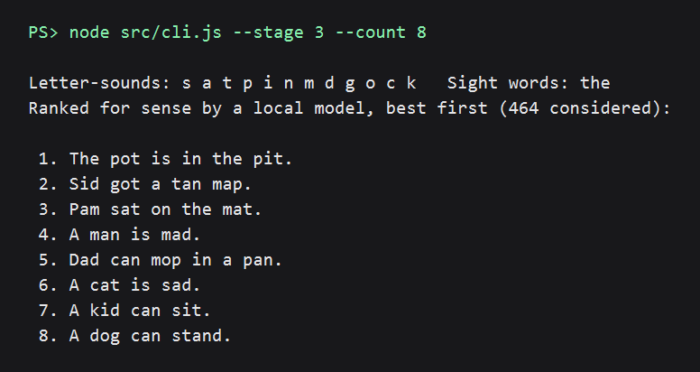

# readable-for-her

Practice sentences a beginner reader can actually sound out.

You tell it which letter-sounds a child has been taught so far. It writes short sentences using only
those sounds, then a small open-weight language model running on your own computer puts the ones
that make sense at the top.

```
$ readable --stage 3 --count 8
Letter-sounds: s a t p i n m d g o c k   Sight words: the
Ranked for sense by a local model, best first (463 considered):

 1. The pot is in the pit.
 2. Sid got a tan map.
 3. Pam sat on the mat.
 4. A man is mad.
 5. Dad can mop in a pan.
 6. A cat is sad.
 7. A kid can sit.
 8. A dog can stand.
```

Every word above uses only the twelve sounds in the first three sets, plus the sight word "the".



The images in `docs/` are rendered from the tool's real output (run with `--offline` after the model was cached).

## Why

Early readers learn letter-sounds a few at a time. A sentence is only useful practice if every word
in it can be sounded out with the sounds learned so far. Most "easy" sentences fail that test: "The
duck is in the pond" looks simple, but a child who knows `c` and `k` and has not met `ck` cannot read
"duck".

Writing sentences under that constraint by hand is slow, and the supply runs out fast.

## The ladder: from hearing sounds to reading a story

A child who cannot yet blend sounds by ear will not blend them from print. So the tool does not
start with sentences. It starts with listening, and climbs:

| Step | Command | What she does |
|---|---|---|
| 1. Listen | `readable --step ear --ear D` | No letters. You say "a ... m", she says "am". Five levels, A to E, biggest pieces first. |
| 2. Two sounds | `readable --step two --stage 2` | Reads two-sound words: at, in, am. |
| 3. Three sounds | `readable --step words --stage 3` | Sounds out m-a-p, then says "map". Words that start with a stretchy sound (mmm, sss) come first. |
| 4. Chains | `readable --step chain --stage 3` | tin, pin, pit, sit, kit: one sound changes each time. |
| 5. Phrases | `readable --step phrases --stage 3` | the cat and the dog |
| 6. Sentences | `readable --stage 3` | The pot is in the pit. |
| 7. A story | `readable --step story --stage 3` | Five sentences about one person: actual reading. |

`readable --ladder` prints this with the instruction for each step. Every step tells you the same
rule for moving on: four out of five without help, on two different days. The grown-up decides;
the tool never promotes her on its own.

In a story the model does a different job. It reads the story so far together with each possible
next sentence and keeps the one that follows most naturally. Two rules stop it doing what language
models like to do, which is repeat themselves: a sentence must end somewhere new, and must not be
built like the one before it.

```
$ readable --step story --stage 3 --count 5
Kim is on the mat.
Kim sat on the pit.
The map is in the pan.
Kim got the pot.
Kim is mad.
```

The listening levels are: A two words joined (rain ... bow), B two beats (ta ... ble), C first sound
then the rest (m ... at), D two sounds (a ... m), E three sounds (m ... a ... n).

## How it works

Two parts, each doing what it is good at:

1. **Rules guarantee she can read it.** A word counts as readable only if it splits, left to right,
   into letter-sounds she has been taught. Digraphs are strict: `duck` needs `ck`, `bell` needs `ll`, and `sock` is never s-o-c-k.
   Sentences are assembled from a bank of about 140 regular words using thirteen sentence shapes.
   This step cannot produce an unreadable word, and the tests check that at every stage.
2. **A model picks the ones that make sense.** Rules can build "A mat can dig" as easily as "A pig
   can dig". [SmolLM2-135M](https://huggingface.co/HuggingFaceTB/SmolLM2-135M-Instruct), an
   open-weight model (Apache-2.0), scores how surprising each sentence is, and the least surprising
   ones win. Sentences are compared within their own shape, because a language model otherwise
   favours whatever pattern is shortest.

The model never writes text. It only ranks. So nothing it does can put an unreadable word on the page.

## Install

Needs Node.js 20 or newer.

```
git clone <this repo>
cd readable-for-her
npm install
node src/cli.js --stage 3
```

The first run downloads the model (about 120 MB) from Hugging Face and caches it. After that, add
`--offline` and it never touches the network. It used about 400 MB of memory on an 8 GB laptop and
scored each sentence in roughly a tenth of a second when memory was free. On the same laptop with
almost no free memory, a full page took about a minute and a half. It prints its progress while it works.

## Use

`readable` below means `node src/cli.js` (or run `npm link` once to get the `readable` command).

```
readable --stage 3                 ten sentences using the first three letter-sets
readable --letters s,a,t,p,i,n     use exactly these letter-sounds instead
readable --stage 4 --focus ck      prefer sentences that practise "ck"
readable --check "The duck is in the pond" --stage 3
                                   show which words she cannot read yet
```

| Option | Meaning |
|---|---|
| `--count N` | How many sentences (default 10) |
| `--tricky a,b` | Sight words she knows (default: `the`) |
| `--seed N` | Repeat a run exactly (default 1); change it for a fresh page |
| `--no-model` | Skip the model: sentences are readable but not ranked for sense |
| `--offline` | Never contact the network |
| `--model ID` | Another open-weight causal language model from Hugging Face |
| `--json` | Machine-readable output |

Letter-sets follow the order most UK synthetic-phonics programmes use (Letters and Sounds, Phase 2
sets 1-5 and Phase 3 sets 6-7):

| Set | Letter-sounds |
|---|---|
| 1 | s a t p |
| 2 | i n m d |
| 3 | g o c k |
| 4 | ck e u r |
| 5 | h b f ff l ll ss |
| 6 | j v w x |
| 7 | y z zz qu |

If your programme teaches a different order, pass the exact sounds with `--letters`.

## Limits

- Stories are loose: one person, things happening, no real plot. They are for reading practice, not literature.
- The model is tiny, so some sentences are silly ("A hen can mop"). They are still readable, which
  is the part that has to be right. Read the page before you hand it over.
- Set 1 alone (`s a t p`) cannot make a sentence with this word bank; the tool says so.
- English only, short-vowel words only. No long vowels, blends are limited to a few words.
- The word bank is small and hand-written. Adding words is one line in `src/words.js`.

## Tests

```
npm test
```

Twenty-five tests. One of them generates sentences at all seven stages and checks every word of every
sentence against the phonics rules. One loads the real model and checks it prefers sense to nonsense;
set `READABLE_SKIP_MODEL=1` to skip that one.

## Built with

- [Transformers.js](https://github.com/huggingface/transformers.js) (Apache-2.0) to run the model locally
- [SmolLM2-135M-Instruct](https://huggingface.co/HuggingFaceTB/SmolLM2-135M-Instruct) (Apache-2.0)

The code in this repository was written by an AI coding agent (Claude Code) working to its owner's
direction, during the DEV Hacktoberfest 2026 Weekend Challenge window.

## Licence

MIT
